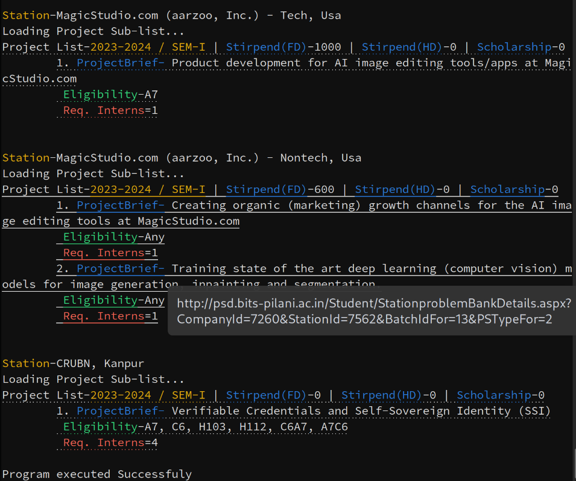
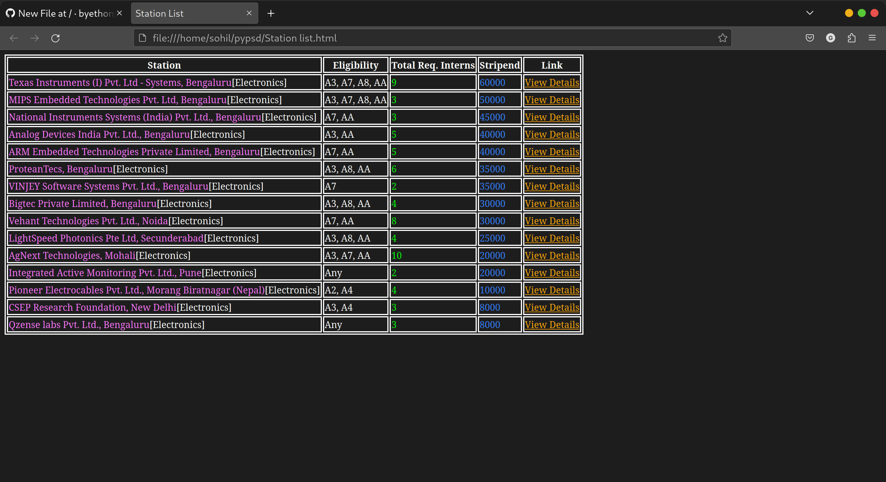

# py-psd-bits
A python based automation script to scrape data off psd.bits-pilani.ac.in/ and output it in a more consolidated and human readable manner.

# Requirements
Python requests module is required for this script to work.     
Run 'pip install requests' to install it.    
The script has been test on Python 3.11 running on both Windows and Linux based machines. Mac support even though untested should be present regardless.    

# Before Running the script
Update the 'psdemail' and 'psdpass' variables in the pypsd.py file and update the filtering variables as per the requirement.      

# Running the script
Open Terminal    
'cd' into the script directory     
Run pyhton pypsd.py to launch the script.      

# Example Output
The output from the script will appear on the console as well as a HTML file named Station list.html in the base directory of the script.    

Console output    
     

HTML output    
